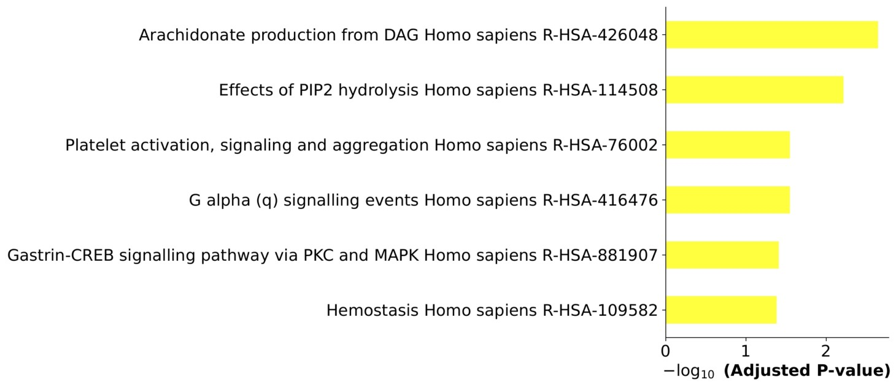

# InternLM2-Chat-7B 生信研究员版

生物信息学是一门涉及生物学和计算机科学的交叉学科，旨在利用计算机技术处理和分析生物学数据。

InternLM2-Chat-7B 生信研究员版 是一个用于生物信息学研究的工具，它能够编写Python代码、连接远程数据源并进行分析。其中一项重要功能是执行基因富集分析，并生成必要的图表。

## 功能特点
Python编程能力: 代理器具备Python编程能力，可以轻松编写自定义的分析代码。

远程数据源连接: 可以连接远程数据源，获取生物学数据进行分析。

基因富集分析: 提供基因富集分析功能，帮助用户理解基因列表中的功能相关性。

图表输出: 输出分析结果的图表，使用户能够直观地理解数据分析结果。

## 为什么选择InternLM2-Chat-7B 生信研究员？

为生物学研究人员提供了一个便捷且强大的工具，能够帮助他们进行复杂的数据分析。
通过使用该代理器，用户可以节省大量时间并提高分析的准确性和效率。
无论是对基因组学、转录组学还是蛋白质组学数据的分析，生物信息学研究代理器都能够提供可靠的支持。

## 示例
以下是执行基因富集分析的示例:

### input
'''
基因富集分析 人类 基因：ABHD12 基因数据库：Reactome_2016, 画黄色的图
'''

### output

## Screenshot

## 贡献

### BaseModel
InternLM2-Chat-7B (https://openxlab.org.cn/models/detail/OpenLMLab/internlm2-chat-7b)

欢迎提交问题报告或提出改进意见。您可以通过提出问题报告或发送合并请求来贡献您的代码。

## 版权信息
该项目遵循 MIT 开源许可证。请查阅 LICENSE 以获取更多信息。